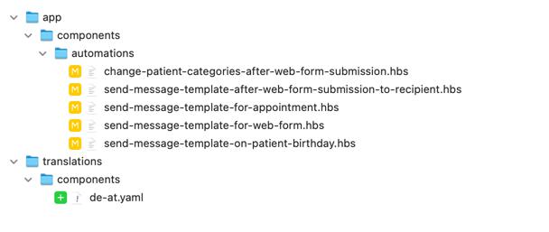

[](https://github.com/<your-github-handle>/ultimed-i18n/actions/workflows/ci.yml)

# ultimed-i18n

This codemod helps to convert the app from bare strings to i18n compatible keys that are used by [`ember-intl`](https://ember-intl.github.io/ember-intl/).

Unfortunately, JS classes can contain too many instances of possible words for translation so it is not feasible to automatically change the classes in the same way that `hbs` files can be changed. Instead, we use [`franc`](https://github.com/wooorm/franc) to check for possible natural language and point it out by adding `!CHECK TRANSLATION!` to the string; then the string can be manually checked and moved to the relevant file if needed.

## Usage

This package is not published to any package management store and so you will need to add it to your project directly from github.

```sh
pnpm add https://github.com/foos-bar/ultimed-i18n.git -D
```

Once installed, you can run it within your project with npx:

```sh
npx ultimed-i18n
```

> Note: While it is possible to run the codemod over the entire project in one go, it's highly recommended to do it in chunks using the `--filter` argument. See [Arguments](#arguments) for more details.

### Arguments

`--root`: [optional] Specify the project root (default is the current folder)

```sh
npx ultimed-i18n --root <path/to/your/project>
```

`--filter`: [optional] Specify which folders to run the codemod over

```sh
npx ultimed-i18n --filter app/components/foo
```

The filtering is quite flexible and so you can use it for individual files or folders of files. e.g. `npx ultimed-i18n --filter app/components/a` will run the codemod over all folders and files within the `components` folder that begin with `a`.

`--threshold`: [optional] Specify the threshold (between 0 - 1) at which the codemod will point out German words. Reducing the threshold will result in a higher change that a Literal is interpretted as German. (default is 1)

> Note: this is only relevant for JS files

```sh
npx ultimed-i18n --threshold 0.5
```

### Limitations

There are some instances that will require manual input, these will be easy to find with a global search as the codemod will add `!CHECK TRANSLATION!` to any strings it wasn't able to parse automatically.

Trying to programmatically detect natural language within code is quite a challenge and doesn't always work, so please be warned that sometimes this codemod will flag something as being German that isn't or not flag something that is. In general, this codemod helps to reduce a lot of the manual work required, but it is _not_ perfect, so it's highly recommended to work slowly and thoroughly and double check everything done by the codemod.

## Example

There are lots of files in the codebase and we want to make our lives as easy as possible, so we will break up this task into the smallest relevant chunks.

### Step 1 - run the codemod

First we can start with translating a small folder of components:

```sh
npx ultimed-i18n --filter app/components/automations
```

The codemod has gone through all of the files within the `app/components/automation.` folder and converted all of the found strings into translation keys, which are in the newly created `translations/components/de-at.yaml` file.



Looking at one of the files, we can see the changes that have been made:

```diff
<div class="form-group">
-  <label for="offset">Web Formular</label>
+  <label for="offset">{{t "components.automations.change_patient_categories_after_web_form_submission.a2066fe9"}}</label>
  <WebFormSelector
-    @placeholder="Web Formular auswählen..."
+    @placeholder={{t "components.automations.change_patient_categories_after_web_form_submission.a5e58c74"}}
    @multiple={{true}}
    @selection={{this.selectedWebForms}}
    @selectionChanged={{this.updateWebForms}}
  />
</div>
<div class="form-group">
  <label for="offset">{{@offsetLabel}}</label>
  <DdauDecimalInput
    @inputId="offset"
    @value={{this.offsetInMinutes}}
    @inputChanged={{this.updateOffset}}
  />
</div>
<div class="form-group" data-test-categories-to-add>
-  <label>Folgende Kategorien hinzufügen</label>
+  <label>{{t "components.automation.change_patient_categories_after_web_form_submission.48b94af8"}}</label>
  <PatientCategorySelector
    @multiple={{true}}
    @selection={{this.categoriesToAdd}}
    @selectionChanged={{this.updateCategoriesToAdd}}
  />
</div>
<div class="form-group" data-test-categories-to-remove>
-  <label>Folgende Kategorien entfernen</label>
+  <label>{{t "components.automation.change_patient_categories_after_web_form_submission.70a6aa94"}}</label>
  <PatientCategorySelector
    @multiple={{true}}
    @selection={{this.categoriesToRemove}}
    @selectionChanged={{this.updateCategoriesToRemove}}
  />
</div>
```

As you can see, the codemod has removed all instances of bare strings from the template and replaced them with the `t` helper from `ember-intl`, referencing the new key for the string.

**The translation key has the following structure**

`components|templates|routes|controllers.<file_name>.<hash>`

1. The first part of the key is referencing which type of file it is.
2. The second part is the snake_cased file name.
3. The final part is a hash of the string.

> Note: due to the way the strings are hashed, the same strings will have the same hash within a component, resulting in a single instance that is referenced multiple times. i.e. if a component has the string "hello world" 3 times throughout the component. All three instances of that string will receive the same hash and reference the same translation key. This is usually not a problem but something to consider when adding languages that may have differing contextual translations.

As you can see from the screenshot above, only `hbs` files have been updated, so we can have some confidence that the component classes did not contain strings that might need updating. Unfortunately, we cannot be absolutely certain that this is the case, so it's still worth manually confirming that there are no strings in the component that need updating.

### Step 1.1 - remove the lint-disable comment

Each `hbs` file that has bare strings will have `{{! template-lint-disable no-bare-strings }}` at the top of the file. This can now be removed.

### Step 2 (when necessary) - manually update the translations

As mentioned above, there are occasions where manual input is required. Thankfully, the codemod will make it obvious where a human is needed by adding `!CHECK TRANSLATION!` where it has detected something it wasn't able to process.

So the best way to look for these instances is to do a global search and see if/where they appear.

### Step 2.1 - manually update the template strings

For this example, we'll use another component which has some dynamic strings.

After running the codemod, we see this change:

```diff
<a
  class="btn btn-default btn-block"
  {{action (mut this.showInputs) true}}
  data-test-add-name-or-label
>
  <XIcon @icon="plus" />
-    {{if this.showNameInput "Bezeichnung" "Name"}}
-    hinzufügen...
+    {{if this.showNameInput "Bezeichnung" "Name"}}<!--!CHECK TRANSLATION!-->
+    {{t "components.address_editor.812c05c9"}}
</a>
```

And after a global search for `!CHECK TRANSLATION!`, we have found this issue. The issue here is that `ember-intl` cannot handle these types of boolean statements, so we will need to break this out into an `if/else` block.

```diff
<a
  class="btn btn-default btn-block"
  {{action (mut this.showInputs) true}}
  data-test-add-name-or-label
>
  <XIcon @icon="plus" />
-    {{if this.showNameInput "Bezeichnung" "Name"}}
-    hinzufügen...
+    {{#if this.showNameInput}}
+      {{t "components.address_editor.812c05c9"}}
+    {{else}}
+      {{t "components.address_editor.new_key"}}
+    {{/if}}
</a>
```

We will then need to update the translation file to reflect this change. After the codemod, the `translations/components/de-at.yaml` file will look something like this:

```yaml
address_editor:
  ...
  812c05c9: hinzufügen...
  ...

```

And we will need to update the initial translation, then add a new key and new translation string:

```diff
address_editor:
  ...
-  812c05c9: hinzufügen...
+  812c05c9: Bezeichnung hinzufügen...
+  new_key: Name hinzufügen...
  ...
```

The keys can be whatever you choose (we will come back to this later) but it is important that the correct string is matching the correct key.

This next example is a little more complicated but still works in the same way. This time we have the dynamic part of the string in the middle of a sentence. Here's how it looks after the codemod (notice the `!CHECK TRANSLATION!`):

```diff
-<p>I'm a {{if thing "little" "big"}} teapot.</p>
+<p>{{t "components.address_editor.b06ab874"}} {{if thing "little" "big"}}<!--!CHECK TRANSLATION!--> {{t "components.address_editor.4b562406"}}</p>
```

The process remains the same, we will first split it into an `if/else` block:

```diff
-<p>{{t "components.address_editor.b06ab874"}} {{if thing "little" "big"}}<!--!CHECK TRANSLATION!--> {{t "components.address_editor.4b562406"}}</p>
+<p>
+  {{#if thing}}
+    {{t "components.address_editor.b06ab874"}}
+  {{else}}
+    {{t "components.address_editor.4b562406"}}
+  {{/if}}
+</p>
```

And then we need to update the translations file. This time, we already have two keys so we don't need to create a new one, we just need to update them to have the correct text:

```diff
address_editor:
  ...
-  4b562406: teapot
-  b06ab874: I'm a
+  4b562406: I'm a big teapot
+  b06ab874: I'm a little teapot
  ...
```

> Note: this codemod covers the majority of element properties that might need translations via `value`, `placeholder`, `entityLabelPlural` and `entityLabelSingular`, but not other custom element properties. So it is always worth double-checking that all relevant properties have also been updated.

### Step 2.2 - manually update the class strings

As previously mentioned, the codemod isn't able to detect natural language with a level of accurancy that allows us to automatically convert strings into translation keys in the way it is able to in the templates. With that said, the codemod will try its best to find any possible German strings and point them out so that they can be found and corrected more easily.

> Note: The codemod will give many false positives as well as false negatives, so it is vital that you double-check the files to see if any translations have been missed.

In this example, a component has been found that correctly has German text within the class and the codemod has added "!CHECK TRANSLATION!" to make it easier to find.

```diff
  saveAppointment: task(function* () {
    if (!this.get('appointment.currentTitle')) {
-      return this.notify.alert('Der Termintitel darf nicht leer sein.');
+      return this.notify.alert('Der Termintitel darf nicht leer sein. !CHECK TRANSLATION!');
    }
    const { validations } = yield this.appointment.validate();
    if (validations.get('isInvalid')) {
      return this.set('forceValidation', true);
    }
    try {
      yield this.appointment.save();
      this.relationshipSnapshot.deleteRelationshipSnapshot(this.appointment);
-      this.notify.success('Der Termin wurde erfolgreich gespeichert.');
+      this.notify.success('Der Termin wurde erfolgreich gespeichert. !CHECK TRANSLATION!');
      this.set('isEditing', false);
    } catch (e) {
-      this.notify.warning('Der Termin konnte nicht gespeichert werden.');
+      this.notify.warning('Der Termin konnte nicht gespeichert werden. !CHECK TRANSLATION!');
    }
  }),
```

This step will be totally manual.

First, we will need to navigate to the `translations/components/de-at.yaml` file and look for the relevant key. In this case, a key has been automatically generated by the codemod but if there is no key, you simply need to create one yourself (I recommend adding it in alphabetical order and using snake_case for the component name). Then we need to add a descriptive key along with the text from the component class.

```diff
appointment_list_info:
  413395b1: Nachricht senden...
  4b97278b: Abbrechen
  510a3857: Folgetermin finden...
  b97d23bf: Speichern
+ appointment_title_alert: Der Termintitel darf nicht leer sein.
+ appointment_success: Der Termin wurde erfolgreich gespeichert.
+ appointment_warning: Der Termin konnte nicht gespeichert werden.
```

> Note: as previously mentioned, the keys are up to you, but I recommend using keys that are descriptive to avoid clashes.

Now that we have the keys, we will need to return to the component class and update the string to use the `intl` service.

```diff
+ import { inject as service } from '@ember/service';

export default Component.extend({
+ intl: service(); // or in glimmer classes: @service intl;

  saveAppointment: task(function* () {
    if (!this.get('appointment.currentTitle')) {
-      return this.notify.alert('Der Termintitel darf nicht leer sein. !CHECK TRANSLATION!');
+      return this.notify.alert(this.intl.t("components.appointment_list_info.appointment_title_alert"));
    }
    const { validations } = yield this.appointment.validate();
    if (validations.get('isInvalid')) {
      return this.set('forceValidation', true);
    }
    try {
      yield this.appointment.save();
      this.relationshipSnapshot.deleteRelationshipSnapshot(this.appointment);
-      this.notify.success('Der Termin wurde erfolgreich gespeichert. !CHECK TRANSLATION!');
+      this.notify.success(this.intl.t("components.appointment_list_info.appointment_success"));
      this.set('isEditing', false);
    } catch (e) {
-      this.notify.warning('Der Termin konnte nicht gespeichert werden. !CHECK TRANSLATION!');
+      this.notify.warning(this.intl.t("components.appointment_list_info.appointment_warning"));
    }
  }),
})
```

### Step 3 - update the translation keys

After the translations have been successfully moved from the templates/classes into the relevant translation files. It would be a good idea to go through the keys and update them to be more descriptive. The easiest way to do this is to go to the relevant `translations` file, then do a global search for a key (ensuring that only the relevant files are selected) and update it within the IDE. This should update it both in the `translations` and the Ember file.

> Note: while not a necessity, you might find it easier to handle the translations if they are prefixed with the function they serve. i.e. a placeholder for foo could have the key `placeholder_foo`

```diff
// translations/components/de-at.yaml
address_editor:
-  a763ca07: Straße
-  c05fc5cd: Stadt
-  cd31dae2: PLZ
-  fbd39fe0: No.
+  street: Straße
+  city: Stadt
+  postcode: PLZ
+  number: No.
```

```diff
// app/components/address-editor.hbs
<div class="col-sm-8 street">
-  <Ui::Input::Text placeholder={{t "components.address_editor.a763ca07"}} @value={{this.address.street}} class="col-sm-8" />
+  <Ui::Input::Text placeholder={{t "components.address_editor.street"}} @value={{this.address.street}} class="col-sm-8" />
</div>
<div class="col-sm-4 street-number">
-  <Ui::Input::Text placeholder={{t "components.address_editor.fbd39fe0"}} @value={{this.address.streetNumber}} class="col-sm-4" />
+  <Ui::Input::Text placeholder={{t "components.address_editor.number"}} @value={{this.address.streetNumber}} class="col-sm-4" />
</div>
<div class="col-sm-4 postal-code">
  <PowerSelectTypeahead
    @triggerClass="form-control"
-    @placeholder={{t "components.address_editor.cd31dae2"}}
+    @placeholder={{t "components.address_editor.postcode"}}
    @matchTriggerWidth={{false}}
    @search={{perform this.searchPostalCode}}
    @selected={{this.address.postalCode}}
    @onChange={{action "postalCodeSelected"}}
    as |code|
  >
    {{code.code}}
    {{code.city}}
  </PowerSelectTypeahead>
</div>
<div class="col-sm-8 city">
-  <Ui::Input::Text placeholder={{t "components.address_editor.c05fc5cd"}} @value={{this.address.city}} class="col-sm-8" />
+  <Ui::Input::Text placeholder={{t "components.address_editor.city"}} @value={{this.address.city}} class="col-sm-8" />
</div>
```

If there are multiple strings within a folder that use the same translation, this can also be separated into its own key, though this should only be done sparingly and in folders containing the exact same strings

```diff
+ address:
+   street: Straße
+   city: Stadt
+   postcode: PLZ
+   number: No.
- address_viewer:
-   street: Straße
-   city: Stadt
-   postcode: PLZ
-   number: No.
- address_editor:
-   street: Straße
-   city: Stadt
-   postcode: PLZ
-   number: No.
```

Don't forget, you'll also need to update the usage of these keys.

> Note: I would not recommend reordering the keys at this point, because the codemod will alphabetise all keys the new time it is run.

## Moving common keys into their own file

Words like "Ja" or "Nein" are relevant across the app and are not specific to a particular component. If desired, these types of strings could be moved into the `translations/common/de-at.yaml` file. It is best to keep any strings that _could_ be specific in its relevant file to ensure that a change in the future doesn't have an unexpected impact across the app.

I'd also recommend doing this step after all of the other translations have been done so that the strings can be updated once, rather than after each time the codemod is run.

## Adding a new language

Once all of the translations in the current app have been moved to the relevant `translations` file. A new language can be added by simply duplicating each of the `de-at.yaml` files, renaming them to the new language - e.g. `en-us.yaml` - and updating all of the values.

**The keys should not be changed as this will cause the translations to stop working**

## Reducing the threshold

As mentioned in [Step 2.2](#step-22---manually-update-the-class-strings), the natural language detection is not perfect and will show both false positives and false negatives with its default settings.

If you want to allow for more possibilities of German words to be found, you can reduce this number by passing any number between 0 - 1 into the codemod command as mentioned in [Arguments](#arguments) but this will increase the risk of false positives as well as false negatives.

## License

This project is licensed under the [MIT License](LICENSE.md).
